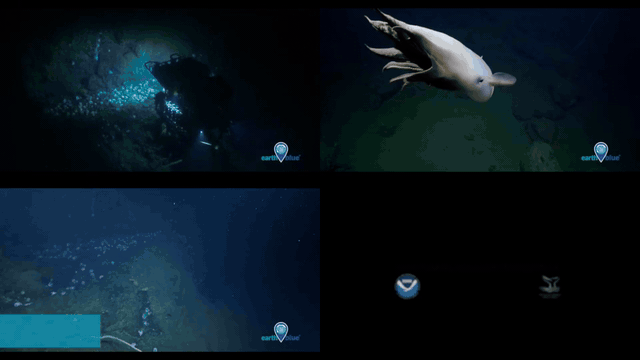

# mpv MultiView

**Multi-Video, Highlight & Detail Viewer**

mpv MultiView 是基于 [mpv](https://github.com/mpv-player/mpv) 开发的多视频、精彩片段与
画面细节浏览器，适用于 Windows 和 Intel Mac（macOS 12 或更高版本）。它在单个进程、单个窗口和单个 GPU
输出中，让同一视频的不同时间点或多个视频同时播放，最多支持 16 个画面。

选中某个画面后，可以按住鼠标左键临时放大局部区域，并拖动改变观察中心，方便查看
人物、动作与画面细节；松开鼠标即可恢复完整画面。

上图会自动循环播放；点击图片可查看更清晰的 MP4 版本。

## 快速使用

直接运行 `mpv-grid.exe`，再把视频拖入窗口。第一个视频会自动填满当前布局；把其他视频
拖到某个格子，可替换或加入该格的播放队列。程序会记住上次布局和单视频播放进度。

| 操作 | 快捷键或鼠标 |
| --- | --- |
| 1×1 普通模式 | `1`（`0` 也可） |
| 2×2 / 3×3 / 4×4 | `2` / `3` / `4` |
| 2×3 / 3×4 | `5` / `6` |
| 保存当前精彩现场到桌面 | `F1` |
| 从各格上次进度继续 | `F2` |
| 关闭窗口 | `Esc` |
| 当前格播放或暂停 | `Space` |
| 全部播放或暂停 | `Ctrl+Space` |
| 选择格子 | 单击、`Tab` / `Shift+Tab` |
| 临时放大并移动观察中心 | 按住左键并移动 |
| 当前鼠标格前后移动 5 秒 | 滚轮 |
| 点击进度跳转 | 单击格子内的 OSD 进度条 |
| 当前格静音 / 独奏 | `M` / `Shift+M` |
| 全屏 | `F` |

`F1` 会在桌面生成带完整 Grid 截图图标的 `.lnk`，双击后从收藏时各格的位置播放。
`F2` 会静默切换到各格最近保存的进度。播放现场包含布局、多文件队列、文件路径、
固定起点、续播位置和声音状态。

默认同时播放最近选中的 3 个格子的声音。可在 `mpv-grid.ini` 中通过
`grid-audio-count=3` 调整数量，也可修改快捷键和常用 mpv 参数。

画面始终保持原始宽高比，不裁切、不拉伸。格子之间紧贴；必要的黑边只出现在完整
Grid 画布外侧。窗口会根据视频与屏幕分辨率自动选择大小，并保证单格不放大超过首个
视频的原始显示分辨率。

如需视频文件右键菜单，请将两个 BAT 脚本与 `mpv-grid.exe` 放在同一目录：运行
`install-mpv-grid-context-menu.bat` 安装，运行 `uninstall-mpv-grid-context-menu.bat`
卸载，不需要管理员权限。

## 演示素材

演示使用了 Wikimedia Commons 明确标记为美国公共领域的 NASA/NOAA 视频：
[深海章鱼花园](https://commons.wikimedia.org/wiki/File:Wk215-deep-sea-octopuses.webm)、
[热带低压 Edouard 卫星图](<https://commons.wikimedia.org/wiki/File:Edouard_Brings_Deluge_of_Rain_to_Southeast_Texas_(CIRA_2026-09-02_-_nolabels).webm>)、
[ISS 夜间地球延时摄影](<https://commons.wikimedia.org/wiki/File:ISS072-E-1079078-1079264-20250413-Night_-_2025-04-13_ISS072_187_Night.webm>)和
[春季风暴日出卫星图](<https://commons.wikimedia.org/wiki/File:Sunrise_on_a_Large_Spring_Storm_(CIRA_2026-04-02_-_nolabels).webm>)。
各素材的作者、来源及具体许可说明以对应文件页面为准。

## 声明与感谢

mpv MultiView 是 mpv 的非官方修改版，保留原项目的版权历史和许可证文件。感谢
[mpv](https://github.com/mpv-player/mpv)、[FFmpeg](https://ffmpeg.org/)、
[libplacebo](https://code.videolan.org/videolan/libplacebo)、
[libass](https://github.com/libass/libass) 和 [MSYS2](https://www.msys2.org/)
的开发者与贡献者。

本项目默认按 GPLv2 或更高版本构建和分发。完整许可信息见 `LICENSE.GPL` 和
`Copyright`。本项目名称及发布包不代表 mpv 官方认可或支持。
